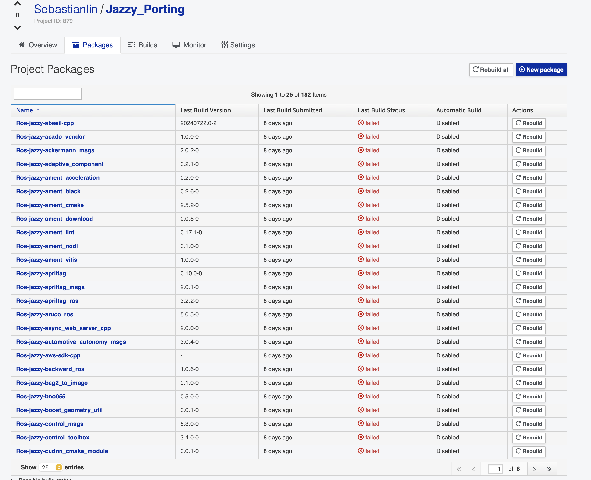

# 使用说明

## 环境准备

建议使用 python 3.6 及以上版本的 python
安装依赖：

```
pip install requests copr-cli copr
```

将 copr-cli 配置文件放置在 ~/.config/copr 目录，这一部分请参考[这里](https://eur.openeuler.openatom.cn/api/)。

接着请保证环境中有 gitee 的访问凭证，通过下面指令修改：

```
export GITEE_USERNAME="your_gitee_username"
export GITEE_TOKEN="your_gitee_access_token"
```

## 使用

### 查看帮助

```
python batch_upload_ros.py
```

如果你没有带输入任何参数，会默认输出简单的用法说明。

### 生成包信息

```
python batch_upload_ros.py createjson
```

脚本会通过上面设置过的 gitee API 获取用户名下的所有仓库列表，检查每个仓库是否存在脚本定义的 TARGET_BRANCH

> TARGET_BRANCH，因为目前我的分支默认是 Multi-Version_ros-jazzy_openEuler-24.03-LTS，所以脚本会根据这个 TARGET_BRANCH 去生成 json，如果你有其他的分支需求请修改。

若存在，则将该仓库的信息（包含 clone_url、推断出来的 spec 文件名等）写入 packages_info.json，以下是片段示例：

```
...
  {
    "repo_name": "vitis_common",
    "full_name": "Sebastianlin/vitis_common",
    "clone_url": "https://gitee.com/Sebastianlin/vitis_common.git",
    "package_name": "Ros-jazzy-vitis_common",
    "spec_name": "vitis_common.spec"
  },
  ...
```

> 推断出来的 spec 文件名指的是使用包名字对 spec 文件进行命名。

### 批量上传

如果你对于生成的 json 文件满意，你可以直接使用指令：

```
python batch_upload_ros.py upload
```

进行批量上传。

## 预期结果



如上图能够正确的批量上传 json 文件中的仓库。

## 存在的问题

如上图能够看到包名称的首字母大写，下一步计划会对这个问题进行修复，其他没有什么问题。

## 其他说明

如果对于脚本有其他疑问，需要更多的帮助可以先自行查看[脚本](./%20batch_upload_ros.py.py)，其中有详细的注释解释脚本。

如果查看完脚本还是有疑问可在本仓库提 issue。
